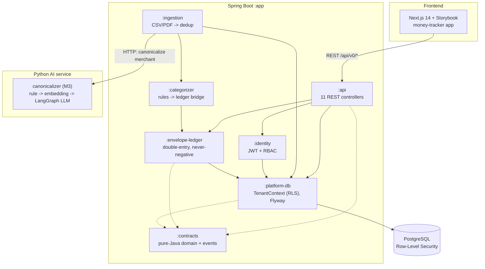

<div align="center">

# 🏦 Money Tracker

### A correctness-first personal-finance app — **hardcore Java (Spring Boot) backend**, a **Python AI statement analyser**, and a **Next.js frontend**.

*A never-negative, double-entry envelope ledger on a multi-tenant, row-level-secured Postgres core, fed by a hybrid ML + LLM transaction-understanding service. Built solo, end-to-end.*

[](https://github.com/FraanW/ledgerline-money-tracker/actions/workflows/ci.yml)


</div>

---

## TL;DR

> A real **financial ledger**, not a CRUD app. Money moves as **double-entry** transactions that are **guaranteed never to overspend an envelope** — and that guarantee holds **under concurrent posting**, proven by an adversarial multi-threaded test suite running against real Postgres in Testcontainers.

If you're evaluating this for a **Java backend** role, start here:

| You care about… | Look at… |
|---|---|
| Concurrency correctness | [`envelope-ledger/LedgerService.java`](backend/envelope-ledger/src/main/java/com/ledgerline/ledger/LedgerService.java) + `LedgerConcurrencyTest` — `SELECT … FOR UPDATE`, deterministic lock ordering, idempotent posting |
| Multi-tenancy done at the DB | [`platform-db`](backend/platform-db/src/main/java/com/ledgerline/platform/db) `TenantContext` — transaction-scoped Postgres RLS via `SET LOCAL`, **not** ThreadLocal |
| AuthN/AuthZ | [`identity/`](backend/identity/src/main/java/com/ledgerline/identity) — Supabase JWT verification (Nimbus JOSE) + data-driven RBAC gate |
| Idempotent ingestion | [`ingestion/IngestionService.java`](backend/ingestion/src/main/java/com/ledgerline/ingestion) — CSV/PDF parsing → dedup via `INSERT … ON CONFLICT` |
| Schema design | [`platform-db` resources](backend/platform-db/src/main/resources) — 13 Flyway migrations, ~1,100 lines of intentional SQL |
| AI / ML transaction understanding | [`services/canonicalizer`](services/canonicalizer) — hybrid rule → embedding NN → **LangGraph LLM** → abstain, precision-first, with eval guardrails |

---

## What it does

Money Tracker ingests your bank activity (CSV / password-protected PDF statements), **categorises** it with deterministic rules, and posts every spend into an **envelope budget** built on a **double-entry ledger**. Unlike aggregators that *categorise after the fact*, this app *constrains spending up front*: you physically cannot overspend an envelope.

The product is a deliberately narrow MVP. **The backend is the work** — correctness, concurrency, multi-tenancy, and auth, all enforced at the layer where it actually counts.

---

## 🏦 The never-negative double-entry ledger

Every money movement is a **balanced transfer**: a set of signed ledger entries that **sum to zero**. Two invariants make the budget *real*, and both are enforced server-side, in Java, under lock:

- **Never-negative** — a user envelope can never drop below zero. Overspend is rejected, not recorded.
- **Atomic transfers** — moving money between envelopes is all-or-nothing, and **correct under concurrent posting**.

How it's enforced (in [`LedgerService`](backend/envelope-ledger/src/main/java/com/ledgerline/ledger/LedgerService.java)):

```
postTransfer(tenant, [entries…]):
  1. assert Σ entry.delta == 0                     // double-entry, checked in-memory (Math.addExact — overflow-safe)
  2. SELECT … FOR UPDATE on each envelope          // row locks, acquired in deterministic UUID order → deadlock-free
  3. recompute balance from ledger_entries         // after the lock, never from a stale read
  4. assert no user envelope goes negative          // else throw WouldGoNegative
  5. INSERT transfer + entries in ONE transaction   // all-or-nothing; rollback on any failure
```

**Idempotency** is structural, not best-effort: a partial `UNIQUE (tenant_id, transaction_id, envelope_id)` (Flyway `V5`) means replaying the same spend yields the *existing* transfer. The race-loser catches `DuplicateKeyException` and re-reads the winner's transfer id. No double-posting, ever.

> Deliberate engineering choice: **no JPA.** Every statement is hand-written `JdbcTemplate` SQL because **the locking timing *is* the design** — an ORM would hide exactly the thing that has to be precise.

---

## 🏗️ Architecture

**8 Gradle modules**, layered so each dependency points one way. The bootable `:app` wires them together; everything else is a focused library.



**Request → ledger flow:** statement upload → `:ingestion` parses & dedups (`INSERT … ON CONFLICT`) → calls the **Python canonicalizer (M3)** over HTTP to clean the noisy merchant string → `:categorizer` matches a rule and resolves the target envelope → `:envelope-ledger` posts the spend under lock → frontend reads it back through `:api`. Every step runs inside one `TenantContext` transaction, so the tenant GUC, the connection, and the work are a single unit.

| Module | Responsibility |
|---|---|
| **`:contracts`** | Pure-Java domain + event contracts — `record`s, sealed event types, enums. Zero Spring. |
| **`:platform-db`** | `DataSource`, transaction-scoped **RLS** via `TenantContext`, Flyway migrations. |
| **`:identity`** | Users, memberships, **Supabase JWT verification**, data-driven **RBAC** gate. |
| **`:envelope-ledger`** | **M12** — the never-negative double-entry ledger. The correctness floor. |
| **`:ingestion`** | **M1** — statement parse (CSV/PDF) → normalise → **idempotent dedup**. |
| **`:categorizer`** | **M11** — rules engine + the `ingestion → categorize → post` bridge. |
| **`:api`** | The v0 HTTP surface — 11 REST controllers behind an auth + RBAC gate. |
| **`:app`** | Spring Boot bootstrap, Flyway runner, Actuator health. |

---

## ☕ Core Java & backend engineering

| Area | What's demonstrated | Where |
|---|---|---|
| **Concurrency** | Pessimistic row locks (`SELECT … FOR UPDATE`), deterministic lock ordering to avoid deadlock, recompute-after-lock | `LedgerService` |
| **Concurrency (tests)** | `ExecutorService`, `CyclicBarrier`, `CountDownLatch`, `AtomicInteger`, `ConcurrentLinkedQueue` storming the ledger with real OS threads | `LedgerConcurrencyTest`, `IngestionConcurrencyTest`, `CategorizerBridgeConcurrencyTest` |
| **Idempotency** | Structural via partial `UNIQUE`; race-loser recovery on `DuplicateKeyException` | `LedgerService`, `IngestionService` |
| **Multi-tenancy** | Postgres **RLS** bound to the transaction (`SET LOCAL app.current_tenant`), explicitly **not** ThreadLocal — survives connection-pool/thread reuse | `TenantContext` |
| **AuthN** | Supabase **JWT** (ES256/RS256) verified against JWKS with Nimbus JOSE; dev-header fallback | `SupabaseJwtVerifier`, `ActingUserResolver` |
| **AuthZ** | Data-driven **RBAC** — `EXISTS` over `memberships → role_permissions → permissions`; `requirePermission` → 403 | `RbacService`, `ApiGate` |
| **Modern Java 21** | `record`s, **sealed** interfaces, text blocks, streams/lambdas, enums, `Math.addExact` overflow guards, pattern `instanceof`, `var` | `:contracts`, throughout |
| **Money correctness** | Integer-minor arithmetic (paise — **no floats**), overflow-checked add/subtract, Indian digit grouping | `Money.java` |
| **Parsing** | Strategy pattern: Commons-CSV + PDFBox (incl. **password-protected** statements), magic-byte content sniffing | `CsvStatementParser`, `PdfStatementParser` |
| **Transaction control** | Explicit `TransactionTemplate` boundaries instead of `@Transactional` — dodges the proxy self-invocation trap | `TenantContext` |
| **Schema evolution** | 13 Flyway migrations: roles → core → RLS → ledger idempotency → rules → identity/RBAC → investments → outbox | `db/migration` |

---

## 🔌 API surface (`/api/v0/*`)

11 REST controllers, every one behind the tenant + user + permission gate:

`identity` (provision user / create workspace / `me` / memberships) · `ingest/statement` (multipart CSV/PDF) · `transactions` (filter + paginate) · `accounts` · `budgets` · `goals` · `holdings` · `net-worth` · `members` (invite, RBAC roles) · `settings` · `statements` · `taxonomy`.

**Auth:** production = `Authorization: Bearer <Supabase JWT>` (verified → user + tenant + RBAC). Dev = `X-Tenant-Id` / `X-User-Id` headers. CORS preflight covered.

---

## 🧪 Testing

**22 test classes**, JUnit 5 + AssertJ, integration tests on **real Postgres via Testcontainers** (dual-mode: containers in CI, or an external port locally). Tests run against the **non-superuser app role**, so RLS is genuinely exercised — not bypassed.

- **`LedgerConcurrencyTest`** — never-negative, atomic-transfer, idempotency, and deadlock-freedom under concurrent threads.
- **`RlsIsolationTest`** — proves one tenant cannot see another's rows.
- **`BearerAuthIntegrationTest` / `SupabaseJwtVerifierTest`** — JWT happy-path + rejection.
- **`IdentityRbacIntegrationTest`** — provisioning, workspace creation, permission checks.
- **`IngestionConcurrencyTest` / `CategorizerBridgeConcurrencyTest`** — concurrent uploads & posting with dedup serialization.
- Plus `MoneyTest`, `DedupHasherTest`, parser tests, `ApiIntegrationTest`, `ApplicationBootTest`.

CI runs the **full `./gradlew build`** (compile + every test, Testcontainers and all) on every backend change — see [`.github/workflows/ci.yml`](.github/workflows/ci.yml).

---

## 🤖 The AI statement analyser — `services/canonicalizer` (Python · FastAPI)

A raw Indian bank line is hostile: `UPI/BLINKIT/blinkcommerce.rzp@axisb/Payment`. The canonicalizer turns it into **`Blinkit` (Groceries)** — and, crucially, says **`UNKNOWN`** when it isn't sure. A wrong label is worse than no label.

It's a **hybrid, precision-first pipeline** — cheap-and-explainable first, expensive-and-smart only for the genuinely ambiguous:

```
normalize ─▶ rule floor ─▶ embedding NN ─▶ confidence gate ─▶ [ LangGraph LLM | ABSTAIN ]
(strip UPI/VPA/   (alias match,    (MiniLM over      (≥accept: take;     (adjudicate the
 refs/city codes)  the cheap floor)  pgvector cosine)  <floor: abstain)    ambiguous middle)
```

- **Deterministic floor** carries the load — auditable, with generic-word traps (COIN / MORE / STAR / TATA) barred from auto-accepting.
- **Embeddings** (sentence-transformers MiniLM over **pgvector**) recover the noisy tail, gated by a corroborating-token precision guard.
- **LangGraph LLM fallback** — a small `StateGraph` (budget-gate → resolve → validate) constrained to the candidate set, behind a hard **`$` spend cap**. It can never invent a merchant.
- **Composed reuse:** M11 categorization and recurring/anomaly detection (free-trap, price-hike, amount-spike) are built *on top of* the same M3 resolution.
- **Fully explainable:** every response carries `method ∈ {rule, embedding, llm, abstain}` + candidates.

**It's evaluated, with the eval wired as a CI gate** (fails on accuracy / abstain-recall / false-accept regression) — default config is the hashing embedder with the LLM off, so CI needs no model download or API key:

| Eval | Result |
|---|---|
| Merchant canonicalization (126 rows) | **94.3%** known accuracy · **100%** abstain recall · **0** false-accepts on UNKNOWN · 99.0% precision |
| Categorization (36 rows) | **100%** accuracy · **100%** uncategorized recall · **0** false categorizations |
| Recurring + anomaly (6-month history) | recurring **P/R/F1 = 100%** · anomalies **100% recall, 0 false-positives** |

**39 pytest tests** (the LangGraph/ML tests `importorskip` cleanly, so the base runtime tests the whole pipeline with deterministic fakes). HTTP surface: `POST /canonicalize`, `/canonicalize/batch`, `/categorize`, `/recurring`, `/healthz`. The Java `:ingestion` module calls it through an `HTTPMerchantCanonicalizer` client (best-effort — ingestion degrades gracefully if the service is down). Full design notes: [`services/canonicalizer/README.md`](services/canonicalizer/README.md).

---

## 🎨 Frontend — Next.js 14, design-system first

The `money-tracker` app (`apps/money-tracker`) is a **TypeScript-strict Next.js 14 (App Router)** front end, **live-wired** to the Java API through a typed fetch client (`src/lib/api.ts`, 30+ endpoints; shared `@ledgerline/types` contracts; money on the wire as `{ minor, currency }`).

- **Token-driven design system** explored **Storybook-first** (19 stories) across **three fully art-directed personas** (Millennial / Gen Z / Senior, the last accessibility-first) — every visual value flows from theme tokens → CSS custom properties → Tailwind. Swap a persona, the whole app re-themes; zero hardcoded colors.
- **12 wired routes** — dashboard, transactions, budget/envelopes, investments, net worth, log, settings, tags, philosophies — with graceful dev fallback when no backend/auth is present.
- Typed data hooks (`useTransactions`, `useBudget`, …) returning `{ data, loading, error, refetch }`; an `ApiError` with an `isWouldGoNegative` helper that surfaces the ledger's core invariant straight into the UI.

---

## 🧰 Tech stack

| Layer | Choice |
|---|---|
| **Backend** | **Java 21**, **Spring Boot 3.4.1** (Web, JDBC, Actuator), Gradle multi-module |
| **Persistence** | **PostgreSQL** + **Row-Level Security**, **Flyway** (V1–V13), hand-written `JdbcTemplate` SQL (no ORM) |
| **Auth** | Supabase JWT (Nimbus JOSE JWT) + data-driven RBAC |
| **Parsing** | Apache Commons CSV, Apache PDFBox |
| **Testing** | JUnit 5, AssertJ, **Testcontainers** (Postgres); pytest + eval guardrails (Python) |
| **AI service** | Python 3.11, **FastAPI**, **LangGraph** + langchain-openai (OpenRouter), sentence-transformers (MiniLM), **pgvector** |
| **Frontend** | Next.js 14 (App Router), React 18, TypeScript (strict), Tailwind, Storybook 8 |
| **Tooling** | pnpm workspace, shared `@ledgerline/types` contracts |
| **Event backbone** | Transactional **outbox** table in place (`V13`) — Kafka fan-out is the next milestone |

---

## ▶️ Running it locally

**Backend** (needs JDK 21 + Docker for Postgres):

```bash
cd backend
./gradlew build          # compile + full test suite (spins up Testcontainers Postgres)
./gradlew :app:bootRun   # boots the API on :8090 (point it at a local Postgres + run Flyway)
```

**AI service** (needs Python 3.11; runs with no model download or API key by default):

```bash
cd services/canonicalizer
python -m venv .venv && source .venv/bin/activate   # (Windows: .venv\Scripts\activate)
pip install -r requirements.txt -r requirements-dev.txt
pytest && python eval/run_eval.py                    # tests + eval guardrail
uvicorn canonicalizer.api:app --reload               # API on :8000
# opt into capability: pip install -r requirements-ml.txt   (MiniLM)
#                      pip install -r requirements-llm.txt  (LangGraph LLM)
```

**Frontend** (needs Node 22 + pnpm):

```bash
pnpm install
pnpm --filter @ledgerline/money-tracker dev          # Next.js dev server
pnpm --filter @ledgerline/money-tracker storybook    # design system on :6006
```

The frontend defaults to `http://localhost:8090` and falls back to a dev sign-in (no real auth keys required) so a fresh clone runs without setup. See [`.env.example`](.env.example) for configuration.

---

## 🗂️ Project layout

```
ledgerline-money-tracker/
├── backend/                 # Java 21 · Spring Boot · Gradle multi-module (the backbone)
│   ├── contracts/           # pure-Java domain + event contracts
│   ├── platform-db/         # TenantContext (RLS) + Flyway V1–V13
│   ├── identity/            # JWT verification + RBAC
│   ├── envelope-ledger/     # the never-negative double-entry ledger
│   ├── ingestion/           # CSV/PDF parse → dedup
│   ├── categorizer/         # rules engine + ledger bridge
│   ├── api/                 # 11 REST controllers
│   └── app/                 # Spring Boot bootstrap
├── services/canonicalizer/  # Python · FastAPI AI service — M3 merchant analyser
│                            #   (rule + MiniLM embeddings + LangGraph LLM + evals)
├── apps/money-tracker/      # Next.js 14 frontend + Storybook design system
├── packages/types/          # shared TS contracts (mirror of :contracts)
├── docs/                    # architecture, data model, API & module maps
└── infra/                   # docker-compose (Postgres) + deploy scaffolding
```

📖 Deeper architecture notes live in [`docs/`](docs/) — module map, DB schema design, and the API/services walkthrough.

---

## A note on scope

This is the first surface of a larger fintech platform (Ledgerline). It runs **end-to-end locally**; a cloud deploy is **deliberately deferred** to keep the focus on backend correctness rather than deployment plumbing. The ledger, multi-tenancy, auth, ingestion, and the wired frontend are all **built and tested** — that's the part worth reviewing.

---

<div align="center"><sub>Built solo by <a href="https://github.com/FraanW">Fraan</a> · Java backend · Python AI service · Next.js frontend</sub></div>
