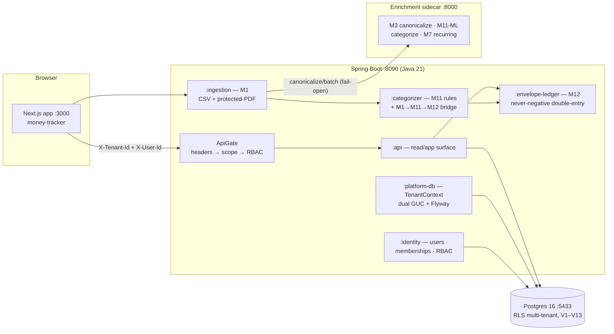

# Ledgerline — API & Services Reference

> **Sweep 5 deliverable** · last verified live 2026-06-07 · every endpoint below
> exists, is RBAC-gated, tested (100+ tests across 8 modules), and was exercised
> over HTTP against the running stack.

## 1. The system at a glance



**The pipeline in one sentence:** a statement (CSV or password-protected PDF)
enters M1 → rows dedup → M3 canonicalizes merchants over HTTP (abstains rather
than guesses) → M11 rules categorize → M12 posts balanced, never-negative
envelope transfers — all inside one tenant-scoped, RLS-enforced transaction
boundary, gated by data-driven RBAC.

## 2. Services & modules

| Service / module | Tech | Port | What it owns |
|---|---|---|---|
| `apps/money-tracker` | Next.js 14 + TS | 3000 | All surfaces: landing, login, dashboard, budget, transactions, philosophies (26 lenses), settings… |
| `backend :app` | Spring Boot 3.4 / Java 21 | 8090 | Boot, Flyway-on-boot, Actuator health |
| `backend :api` | library module | — | The HTTP read/app surface (this doc §4) + CORS + error advice |
| `backend :ingestion` | library module | — | M1: CSV + password-protected-PDF parsing, dedup, statements batches, M3 HTTP client |
| `backend :categorizer` | library module | — | M11 rules engine + the in-process M1→M11→M12 bridge |
| `backend :envelope-ledger` | library module | — | M12: balanced transfers, never-negative floor, pseudo-envelopes |
| `backend :identity` | library module | — | Users, workspaces, memberships, the RBAC gate, control-plane DataSource |
| `backend :platform-db` | library module | — | `TenantContext` (dual GUC: `app.current_tenant` + `app.current_user_id`), Flyway V1–V13 |
| `backend :contracts` | pure Java | — | Domain records/enums (mirror of `@ledgerline/types`) |
| `services/canonicalizer` | Python 3.11 / FastAPI | 8000 | M3 merchant canonicalization (dict + embeddings + capped LangGraph LLM), M11-ML categorize, M7 recurring |
| `ledgerline-db` | Postgres 16 + pgvector | 5433 | The multi-tenant store; RLS is the correctness floor |
| Adminer | container | 8081 | Visual DB console |

## 3. Identity, tenancy & RBAC

**Real auth (live):** requests carry `Authorization: Bearer <supabase access
token>`, verified against the project's **public JWKS** (ES256 — no shared
secret in this codebase). The verified `sub` maps to `users.auth_subject`
(auto-provisioned on first sight via the email upsert), then `RbacService`
checks the endpoint's permission and `TenantContext` opens the dual-GUC
transaction — Postgres RLS does the row filtering. `X-Tenant-Id` remains the
workspace selector (safe: the RBAC check IS the membership validation).
**Dev fallback:** the v0 `X-User-Id` header is still honoured while
`ledgerline.auth.dev-headers-enabled=true` — flip one property to end it.
The whole resolution lives in ONE seam: `ActingUserResolver`.

- **Runtime DB role:** `ledgerline_app` (non-superuser → RLS real, dev = prod).
  Flyway and the identity control-plane use the owner role separately.
- **RBAC is data-driven** (`roles` × 31 `permissions` via `role_permissions`):

| Role | Can |
|---|---|
| `owner` | everything (31) incl. `tenant:manage` |
| `admin` | everything except `tenant:manage` (30) |
| `member` | read all + write financial data (27); no member/role management |
| `viewer` | read everything (15), write nothing |

Denial contract: **403** `{"error":"forbidden","permission":"<key>"}` — always.

## 4. HTTP API — Spring backend (`:8090`, prefix `/api/v0`)

Conventions: all money is **integer paise** (`amountMinor`, `Money{minor,currency}`);
dates ISO (`yyyy-MM-dd`); errors §5. ⚿ = permission required.

### 4.1 Identity (control plane)
| Method & path | Body → Response |
|---|---|
| `GET /identity/me` | `Authorization: Bearer <jwt>` → `{userId, email, displayName, memberships:[{tenantId, tenantName, role, status}]}` — **the login endpoint of the JWT era**; auto-provisions on first sight; 401 on bad/missing token |
| `POST /identity/users` | `{email, displayName, authSubject?}` → `{userId}` — idempotent upsert by email (dev/ops path) |
| `POST /identity/workspaces` | `{ownerUserId, displayName}` → `{tenantId}` — creates tenant + settings + first **owner** membership |
| `GET /identity/users/{userId}/memberships` | → `[{tenantId, tenantName, role, status}]` — the workspace picker (dev path; JWT flow uses `/identity/me`) |

### 4.2 Members ⚿
| Method & path | ⚿ | Body → Response |
|---|---|---|
| `GET /members` | member:read | → `{items:[{userId, displayName, email, role, status, joinedAt}]}` |
| `POST /members` | member:manage | `{email, displayName?, role}` → `{userId, role}` — auto-provisions by email, upserts membership |
| `PUT /members/{userId}` | member:manage | `{role}` → `{userId, role}` — **400** `cannot demote the last owner` |
| `DELETE /members/{userId}` | member:manage | → `{removed:true}` — **400** `cannot remove the last owner`, 404 unknown |

### 4.3 Ingestion (M1) ⚿
| Method & path | ⚿ | Notes |
|---|---|---|
| `POST /ingest/statement` | statement:write¹ | multipart: `accountId`, `file` (.csv or .pdf), `password?` (unlocks protected PDFs **on the fly — in-memory only, never logged/stored**) → `{statementId, totalRows, accepted, duplicates, errors:[{lineNumber,message}]}`. Format by `%PDF` content sniff. Wrong password → 400 `incorrect PDF password`; locked w/o password → 400 asks; scanned PDF → 400 `not supported yet`. Re-upload is dedup-safe. |

¹ gated when `X-User-Id` is present (legacy header-only path stays until JWT).

### 4.4 Transactions ⚿
| Method & path | ⚿ | Notes |
|---|---|---|
| `GET /transactions?from&to&categoryId&q&limit&offset` | transaction:read | → `{items:[{id, accountId, postedAt, amount:{minor,currency}, direction, rawDescription, merchant\|null, categoryId\|null, source, ingestedAt, statementId\|null, recurringSeriesId\|null}], total}` · limit ≤ 200 |

### 4.5 Budget (M12) ⚿ — movements go through `LedgerService`, never raw SQL
| Method & path | ⚿ | Body → Response |
|---|---|---|
| `GET /budget?period=yyyy-MM` | envelope:read | → `{period, envelopes:[{id,name,balanceMinor,categoryId}], unallocatedMinor, incomeMinor, spentMinor}` |
| `POST /budget/envelopes` | envelope:write | `{name, period, categoryId?}` → `{envelopeId}` — category anchor routes M11 spends here |
| `POST /budget/income` | envelope:write | `{amountMinor, description?}` → `{transferId}` — income → Unallocated |
| `POST /budget/allocate` | envelope:write | `{toEnvelopeId, amountMinor, fromEnvelopeId?, description?}` → `{transferId}` — default source Unallocated. Draining a **user** envelope below zero → **422** `would_go_negative`; Unallocated itself MAY go negative **by design** (over-budgeting stays visible, V4) |

### 4.6 Statements / Accounts / Taxonomy ⚿
| Method & path | ⚿ | Notes |
|---|---|---|
| `GET /statements` | statement:read | upload history (counts, status, errors) |
| `GET /accounts` · `POST /accounts` | account:read / write | `{institution, accountType: savings\|current\|credit_card\|other, maskedNumber}` |
| `GET /categories` · `POST /categories` | category:read / write | `{name, kind: income\|expense\|transfer}` |
| `GET /rules` · `POST /rules` · `PUT /rules/{id}` · `DELETE /rules/{id}` | rule:read / write | `{patternKind: contains\|equals\|regex, pattern, categoryId, priority?, enabled?}` — drives M11 |

### 4.7 Settings ⚿
| Method & path | ⚿ | Notes |
|---|---|---|
| `GET/PUT /settings/user` | (X-User-Id only — self-RLS) | `{preferredTheme: genz\|millennial\|senior, locale, logRemindersEnabled, spendingAlertsEnabled}` — **the persona persists here** |
| `GET/PUT /settings/tenant` | settings:read / write | `{monthlyRolloverEnabled, defaultCurrency}` |

### 4.8 Portfolio ⚿ (all CRUD: `GET` · `POST` · `PUT /{id}` · `DELETE /{id}`)
| Resource | ⚿ | Shape |
|---|---|---|
| `/holdings` | holding:read/write | `{name, kind: index\|equity\|debt\|gold\|ulip, investedMinor, valueMinor, expenseRatioBps?, regularPlan?}` |
| `/networth` | networth:read/write | `{itemType: asset\|liability, name, amountMinor, incomeGenerating?, note?}` · GET adds `totals:{assetsMinor,liabilitiesMinor,netMinor}` |
| `/goals` | goal:read/write | `{name, icon?, targetMinor, currentMinor?, envelopeId?}` |

### 4.9 Ops
| Method & path | Notes |
|---|---|
| `GET /actuator/health` | `{"status":"UP"}` — DB-aware; the M16 observability foothold |

## 5. Error contract (uniform)

| Status | Shape | Meaning |
|---|---|---|
| 400 | `{error}` | malformed input, bad UUID/date/enum, PDF password problems, last-owner guard |
| 401 | `{error}` | bearer token missing where required, invalid, expired, or unverifiable — one uniform message, never leaks which check failed |
| 403 | `{error:"forbidden", permission}` | RBAC denial |
| 404 | `{error}` | addressed resource not in this tenant |
| 422 | `{error:"would_go_negative", detail}` | the M12 floor refused — well-formed, but the money isn't there |

## 6. Python enrichment service (`:8000`, FastAPI)

| Endpoint | Purpose |
|---|---|
| `GET /healthz` | mode report (embedder, LLM on/off, threshold) |
| `POST /canonicalize` · `/canonicalize/batch` | M3: `{items:[{raw, merchant_hint?}]}` → `{results:[{raw, canonical\|null, category, confidence, method, candidates}]}` — `null` = **abstain** (precision-first, 0 false-accepts on eval) |
| `POST /categorize` · `/categorize/batch` | M11-ML: fixed-taxonomy categorization (floor → rules → kNN → capped LLM) |
| `POST /recurring` | M7: recurring-series + anomaly detection over a txn history |
| `POST /admin/reindex` | rebuild the merchant index |

JVM ↔ sidecar contract: **fail-open** — sidecar down means merchants stay
NULL; ingestion never breaks. Wire-up: `LEDGERLINE_CANONICALIZER_URL`.

## 7. Runbook (local, Windows)

```powershell
# 1. DB + console (data persists on the ledgerline-pgdata volume)
docker start ledgerline-db ledgerline-adminer          # :5433 / :8081

# 2. Enrichment sidecar
cd projects/ledgerline/services/canonicalizer
./.venv/Scripts/python.exe -m uvicorn canonicalizer.api:app --port 8000

# 3. Backend (runtime = ledgerline_app, RLS real; Flyway = owner)
cd projects/ledgerline/backend
$env:SPRING_DATASOURCE_URL="jdbc:postgresql://localhost:5433/ledgerline"
$env:SERVER_PORT="8090"; $env:LEDGERLINE_CANONICALIZER_URL="http://127.0.0.1:8000"
$env:SUPABASE_URL="<from projects/ledgerline/.env.local>"   # enables JWT auth
./gradlew :app:bootRun

# 4. App (apps/money-tracker/.env.local carries NEXT_PUBLIC_SUPABASE_URL/
#    _ANON_KEY + NEXT_PUBLIC_LEDGERLINE_API — gitignored)
cd ../apps/money-tracker ; npx next dev -p 3000
# real sign-in: anaya@demo.ledgerline / LedgerDemo!2026 → "Sharma Household"

# Tests (Testcontainers can't see this Docker Desktop — use external mode):
docker start ll-test-db                                 # pg16 on :5434
$env:TEST_DATABASE_URL="jdbc:postgresql://localhost:5434/ledgerline"
./gradlew build

# Demo data from scratch: scripts/seed-demo.sh [API_BASE]
```

## 8. What's deliberately next

1. ~~Supabase JWT~~ ✅ live (`SupabaseJwtVerifier` + `ActingUserResolver`;
   backend boot needs `SUPABASE_URL` env; flip
   `ledgerline.auth.dev-headers-enabled=false` to retire the dev header).
2. ~~Frontend supabase-js sign-in~~ ✅ live (graceful dev-login fallback when
   `NEXT_PUBLIC_SUPABASE_*` is unset).
3. Email-confirmation UX: project has confirm-email ON — new sign-ups confirm
   by inbox link before first sign-in (demo user is pre-confirmed via the
   admin API). Optional dashboard toggle for instant-signup demos.
4. Invitations flow (table V7 exists; accept-by-token endpoint pending).
5. M4 outbox relay → Redpanda; M16 OTel dashboards; M17 k6 (per MODULE-MAP).
```
