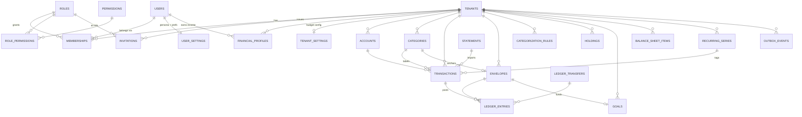

# Database Schema Design — Ledgerline (multi-tenant · multi-user · RBAC)

> **Status:** designed + migrations written & validated (Sweep 0, 2026-06-03).
> All of V1–V13 apply cleanly against `pgvector/pgvector:pg16`; RLS read- and
> write-isolation verified live on the new tables as the non-superuser
> `ledgerline_app` role. App-layer wiring (the `app.current_user_id` GUC,
> control-plane provisioning) is **Sweep 1**.
>
> Decision record: [ADR-0011](../context/decisions/ADR-0011-multiuser-identity-rbac.md).

## 1. What this adds and why

V1–V6 modelled the world as **"tenant == one implicit user"** — there was no
`users` table at all. The Money Tracker frontend audit (settings/profile, persona
themes, investments, net worth, goals, recurring, ingestion status) plus the
explicit requirement for **multi-tenant + multi-user + RBAC** drove this design.

The guiding principle that keeps it **non-breaking**:

```
tenant      = the household / workspace = the RLS isolation boundary  (unchanged)
user        = a person (global identity; can belong to many tenants)
membership  = (user × tenant × role)   = the heart of RBAC
```

The request pipeline resolves the **acting tenant** from the caller's membership,
checks the **role's permissions**, then sets `app.current_tenant` exactly as
before. Every V1–V6 table keeps filtering on that GUC — **none were altered**.

Two product decisions (chosen 2026-06-03):
- **RBAC = data-driven** — `roles` / `permissions` / `role_permissions` tables,
  not a hard-coded enum. Permissions are queryable and editable without a deploy.
- **Auth = Supabase** — `users.auth_subject` maps to Supabase `auth.users.id`
  (the JWT `sub`). We store **no password**. Credentials are Supabase's job.

## 2. ER diagram



## 3. Conventions (inherited from V1–V6, kept)

- **Money** = integer paise in a `*_minor BIGINT` column + a `currency` enum.
  Never numeric/float. The app's whole-rupee mocks map rupees ↔ paise at the API
  edge. (Expense ratios use **basis points** for the same integer-exact reason.)
- **String unions → Postgres `ENUM` types** so the DB rejects bad values.
- **UUID PKs** via `gen_random_uuid()` (pgcrypto); `TIMESTAMPTZ DEFAULT now()`.
- **Tenant isolation** = `tenant_id` FK (integrity) **+** RLS policy (isolation).
- One concern per migration; heavy header comments explain the *why*.

## 4. RLS strategy — control-plane vs tenant-scoped

Two per-connection GUCs carry context (set inside the request transaction):

| GUC | Meaning | Set by |
|---|---|---|
| `app.current_tenant` | the acting tenant/workspace | existing `TenantContext` |
| `app.current_user_id` | the authenticated user (new) | **TenantContext — Sweep 1** |

Each policy coerces unset/empty to NULL via
`NULLIF(current_setting(..., true), '')::uuid`, so an un-scoped connection sees
**zero rows** and can write nothing (fail-closed).

| Table | RLS | Policy |
|---|---|---|
| `tenants` | none | control-plane (defines tenants) — unchanged from V2 |
| **`users`** | ENABLE (not FORCE) | self (`= app.current_user_id`) **or** co-member of `app.current_tenant`. Not FORCE so the owner/control-plane role can **provision** users. |
| **`permissions`** | none | global read-only catalogue |
| **`roles`** | ENABLE+FORCE | system (`tenant_id IS NULL`) visible to all; custom scoped to tenant; app may write **custom only** |
| **`role_permissions`** | ENABLE+FORCE | same shape (denormalised `tenant_id`, NULL for system) |
| **`memberships`** | ENABLE+FORCE | standard tenant isolation |
| **`invitations`** | ENABLE+FORCE | standard tenant isolation |
| **`user_settings`** | ENABLE (not FORCE) | self-only (`= app.current_user_id`) |
| `financial_profiles`, `tenant_settings`, `holdings`, `goals`, `balance_sheet_items`, `recurring_series`, `statements` | ENABLE+FORCE | standard tenant isolation (V3 pattern) |
| **`outbox_events`** | ENABLE (not FORCE) | tenant isolation for producers; the **relay** drains cross-tenant as the owner role (bypasses non-forced RLS) |

**ENABLE-not-FORCE is deliberate** on `users`, `user_settings`, `outbox_events`:
a privileged process (provisioning / the CDC relay) needs to act across the
boundary, and connects as the owner role, which bypasses non-forced RLS. The
runtime `ledgerline_app` role is always constrained.

**Control-plane paths** (run as owner, not via the tenant-scoped request):
- Provisioning a `users` row on first Supabase sign-in.
- "Which workspaces am I in?" — `SELECT tenant_id FROM memberships WHERE user_id = :me` at login, before a tenant is chosen.
- Accepting an invitation by token (the invitee isn't a member of that tenant yet).

## 5. Data-driven RBAC — the seeded matrix

4 **system roles** (`tenant_id IS NULL`, immutable) × **31 permissions**
(`resource:action`, actions = `read` / `write` / `manage`):

| Role | Permissions | Rule |
|---|---|---|
| **owner** | 31 (all) | full control incl. `tenant:manage`, `role:manage` |
| **admin** | 30 | all **except** `tenant:manage` |
| **member** | 27 | every `*:read` + `*:write` on financial data (no member/role/tenant management) |
| **viewer** | 15 | every `*:read` |

Permission resources: `transaction, account, category, envelope, rule, holding,
goal, networth, recurring, statement, profile, settings` (read+write) ·
`member, invitation, role` (read+manage) · `tenant` (manage).

Tenants may also define **custom roles** (`tenant_id` set) with their own
`role_permissions` — same RLS, app-writable. Enforcement: the service layer
checks `permission ∈ role_permissions(membership.role)` per request.

## 6. Migration index

| Ver | File | Adds |
|---|---|---|
| V1–V6 | *(existing)* | tenants, accounts, categories, transactions, envelopes, ledger_transfers, ledger_entries, categorization_rules + RLS |
| **V7** | `identity_and_rbac` | `users`, `roles`, `permissions`, `role_permissions`, `memberships`, `invitations` + seed + RLS |
| **V8** | `user_settings_and_financial_profile` | `user_settings` (persona/theme), `financial_profiles` |
| **V9** | `tenant_settings` | household budget config (rollover, default currency) |
| **V10** | `investments_goals_networth` | `holdings`, `goals`, `balance_sheet_items` |
| **V11** | `recurring_series` | `recurring_series` + `transactions.recurring_series_id` |
| **V12** | `statements` | `statements` + `transactions.statement_id` |
| **V13** | `outbox_events` | transactional outbox (M4) |

All additive — V1–V6 unaltered, so existing tests stay green. **23 base tables** total.

## 7. Validation (2026-06-03)

Applied V1→V13 in version order against a clean `pgvector:pg16` (per-migration
single transaction, `ON_ERROR_STOP`): **all OK**. Seed counts exact
(31/4/31/30/27/15). Live RLS as non-superuser `ledgerline_app`: tenant T1 sees
its `holdings` row, T2 sees 0; T2 inserting a T1-stamped row →
`new row violates row-level security policy`.

## 8. Open items for Sweep 1 (app-layer wiring)

1. **`TenantContext` sets `app.current_user_id`** alongside `app.current_tenant`
   (needed for `users`/`user_settings` self policies).
2. **Control-plane provisioning path** — a Supabase auth webhook (or owner-role
   service) that upserts `users` + a default `user_settings` row + the first
   `owner` membership when a workspace is created.
3. **`@ledgerline/types` + `backend/contracts`** gain the new entities
   (User, Membership, Role, Permission, Holding, Goal, BalanceSheetItem,
   RecurringSeries, Statement, UserSettings, TenantSettings, FinancialProfile).
4. **rupees ↔ paise** mapping at the API edge for the new money columns.
